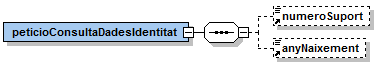
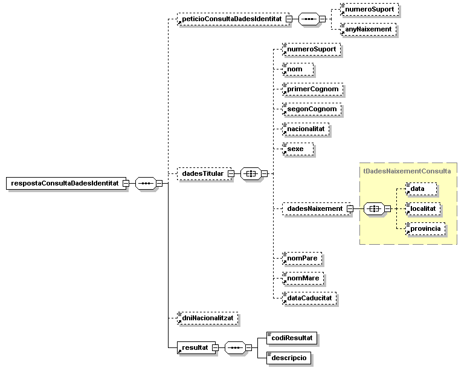
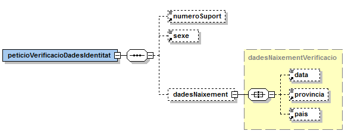
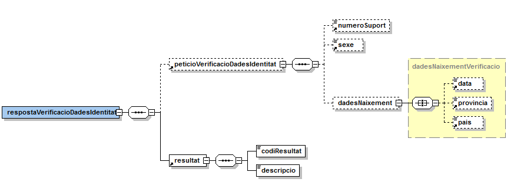

# Via Oberta – DGP
Documentació d'integració del servei DGP del Consorci AOC.

# **Índex** #

1. [Introducció](#1)
2. [Transmissions de dades disponibles](#2)
3. [Missatgeria del servei](#3)
   1. [Consulta de dades d’identitat (IDENTITAT_DADES)](#3.1)
      1. [Petició – dades genèriques](#3.1.1)
      2. [Petició – dades específiques](#3.1.2)
      3. [Resposta – dades específiques](#3.1.3)
   2. [Verificació de dades d’identitat (IDENTITAT_VERIFICACIO)](#3.2)
      1. [Petició – dades genèriques](#3.2.1)
      2. [Petició – dades específiques](#3.2.2)
      3. [Resposta – dades específiques](#3.2.3)
4. [Joc de proves](#4)

# 1 Introducció <a name="1"></a>

Aquest document detalla la missatgeria associada al servei de consulta de dades d'Identitat de la Dirección General de la Policía (en endavant DGP).

Per a poder realitzar la integració cal conèixer prèviament la següent documentació:

- [Document de Missatgeria Genèrica de la PCI del Consorci AOC.][PCI]

[PCI]:https://github.com/ConsorciAOC/PCI


# 2 Transmissions de dades disponibles <a name="2"></a>

Les dades disponibles a través del servei són les que es presenten a continuació:

- **EMISSOR**: DGP – Dirección General de la Policía

| **PRODUCTE** | **MODALITAT** | **DESCRIPCIO** |
| --- | --- | --- |
| **DGP_IDENTITAT** | IDENTITAT_DADES  | Consulta de les dades d’identitat sense dades de residència.
| **DGP_IDENTITAT** | IDENTITAT_VERIFICACIO  | Verificació de les dades d’identitat sense dades de residència.

Les modalitats tenen disponible la versió imprimible del resultat de la consulta en format PDF. Per més detalls adreceu-vos a l'apartat _Extensions de missatgeria_ del document de missatgeria genèrica.

# 3 Missatgeria dels serveis <a name="3"></a>

A continuació es detalla la missatgeria corresponent al bloc de dades específiques de les modalitats de consum del producte.

```
L'emissor de les dades requereix que s'informin les dades del funcionari que realitza la consulta. Així, cal informar els següents camps de l'element Funcionario del bloc de dades genèriques:

/Peticion/Funcionario/NombreCompletoFuncionario
/Peticion/Funcionario/NifFuncionario
//SolicitudTransmision/DatosGenericos/Solicitante/Funcionario/NombreCompletoFuncionario
//SolicitudTransmision/DatosGenericos/Solicitante/Funcionario/NifFuncionario
```

## 3.1 Consulta de dades d'identitat (IDENTITAT\_DADES) <a name="3.1"></a>

Consulta de dades d'identitat.

### 3.1.1 Petició – dades genèriques <a name="3.1.1"></a>

| _Element_ | _Descripció_ |
| --- | --- |
//DatosGenericos/Titular/TipoDocumentacion | Tipus de documentació (NIF / DNI, NIE).
//DatosGenericos/Titular/Documentacion | Documentació. <ul><li>NIF / DNI (8 dígits + caràcter de control).</li><li>NIE ([X,Y,Z] + 7 dígits + caràcter de control).</li></ul>
//DatosGenericos/Titular/Apellido1 | Primer cognom del titular. Opcional, si no s'informa cal informar l'any de naixement de les dades especifiques.

### 3.1.2 Petició – dades específiques <a name="3.1.2"></a>

<p align="center">

</p>

| _Element_ | _Descripció_ |
| --- | --- |
/peticioConsultaDadesIdentitat/numeroSuport | Conté informació per realitzar la consulta sobre un determinat número de suport. La codificació del numero de suport, dependrà del tipus de ciutadà:<ul><li>Ciutadà espanyol: correspon al camp IDESP del DNIe: 3 caràcters alfanumèrics + 6 dígits (p.e:AAA123456)</li><li>Ciutadà estranger comunitari: C + 8 dígits (on els dígits es corresponen al número de certificat comunitari)</li><li>Ciutadà estranger: E + 8 dígits (on els dígits coincideixen al número de targeta d'identificació estrangera)</li></ul>
/peticioConsultaDadesIdentitat/anyNaixement | Si no s'especifica l'element Apellido1 de les dades genèriques cal informar aquest camp.


El camp numeroSuport serà obligatori si el ciutadà és estranger i no s'ha introduït el NIE en el bloc `//DatosGenericos/Titular/Documentacion`.

Cal tenir en compte que el camp que identifica de forma inequívoca a un ciutadà estranger en l'estat espanyol és el TIE. Per tant, si en la consulta s'introdueix el NIE la resposta del sistema pot ser que no sigui l'esperada: es podria donar el cas, per exemple, que es donessin dos registres associats al mateix NIE. Així doncs, per evitar aquestes respostes no esperades, es recomana introduir el TIE en el cas d'un ciutadà estranger.


### 3.1.3 Resposta – dades específiques <a name="3.1.3"></a>

| _Element_ | _Descripció_ |
| --- | --- |
/respostaConsultaDadesIdentitat/peticioConsultaDadesIdentitat | Bloc de dades corresponent a la petició que origina la resposta. |
/respostaConsultaDadesIdentitat/resposta/dadesTitular | Bloc que conté les dades d'una resposta amb dades del titular.
//dadesTitular/numeroSuport | Número suport del titular. La codificació del numero de suport, dependrà del tipus de ciutadà. Més informació a l'apartat de la petició. |
//dadesTitular/nom | Nom del titular de la sol·licitud.
//dadesTitular/primerCognom | Primer cognom del titular de la sol·licitud.
//dadesTitular/segonCognom | Segon cognom del titular de la sol·licitud.
//dadesTitular/nacionalitat | Descripció de la nacionalitat del titular de la sol·licitud.
//dadesTitular/sexe | F: femení / M: masculí / I: indefinit.
//dadesNaixement/data | Data de naixement del titular de la sol·licitud.
//dadesNaixement/localitat | Descripció del municipi de naixement del titular de la sol·licitud.
//dadesNaixement/provincia | Descripció de la província de naixement del titular de la sol·licitud.
//dadesTitular/nomPare | Nom del pare.
//dadesTitular/nomMare | Nom de la mare.
//dadesTitular/dataCaducitat | Data en la que expira el document d'identificació del ciutadà consultat. En el cas de consultar un NIE, la data de caducitat es retornarà buida donat que els NIEs no caduquen (00000000). Pels DNIs permanents es retorna com a data de caducitat el 01/01/9999.
//dniNacionalitzat |
/respostaConsultaDadesIdentitat/resultat/codiResultat | Codi de resultat de l'operació:<ul><li>00: operació realitzada correctament.</li><li>altrament: error realitzant l'operació. Vegeu apartat d'aquest document.</li></ul>
/respostaConsultaDadesIdentitat/resultat/descripcio | Descripció del resultat.

<p align="center">

</p>

#### 3.1.3.1 Codis d'error

A continuació s'especifica la correspondència entre els codi d'error i la descripció associada al mateix per a la operació de verificació d'identitat:

| _Codi_ | _Descripció_ |
| --- | --- |
0A (DNI) |	DNI del titular anul·lat.
02 (NIE) |	Número de suport no comença per E o C. Número de suport erroni.
16 (DNI) |	Número de suport erroni. El número de suport no es correspon a la documentació especificada.
59 (DNI) |	El document sol·licitat està en tràmit de renovació, retingut, retirat per autoritat judicial o anul·lat per duplicitat.<br> Aquest error es dona quan la policia marca aquests DNI per impedir-ne la renovació fins a resoldre alguna incidència vigent. Contacteu amb udea.ws@policia.es per obtenir més detalls sobre aquest document. Mai aquest contacte és per comunicar-lo al ciutadà, sinó per obtenir més detall per part del funcionari o gestor. En aquest cas, al ciutadà (persona física o jurídica) se li ha d'indicar que hi ha un problema amb la seva documentació i cal que es personi a la comissaria més propera per a la seva esmena (no cal cita prèvia).
67 (DNI) |	DNI no assignat.
68 (DNI) |	DNI titular no identificat.
70 (NIE) |	NIE no existeix.
71 (NIE) |	Nacionalitzat espanyol. Nacionalitzat espanyol i existeixen diverses filiacions. En aquest cas, s’ha d’especificar el DNI.
72 (NIE) |	Existeixen diverses filiacions. Per solucionar-ho introduïu més informació a la petició. Si es tracta d'un ciutadà estranger a més d'indicar el NIE, indiqueu el número de suport de les dades específiques el TIE per al cas d'estrangers no comunitaris.
73 (NIE) |	NIE no correspon amb el NIE associat al darrer Suport de la persona.
74 (NIE) |	Número de Suport erroni.
75 (NIE) |	NIE anul·lat, retingut o retornat social / voluntari.
76 (NIE) |	NIE sense suport vàlid.
77 (NIE) |	NIE no correspon amb targeta / certificat.
78 (NIE) |	Número de targeta / certificat no existeix.
79 (NIE) |	Certificat repetit.
80 (DNI) |	Número de suport del DNI erroni.
80 (NIE) |	Nacionalitzat espanyol però no consta el DNI.
83 (NIE) |	Existeixen diverses filiacions pel document.
86 (NIE) |	Menor no acompanyat (MENA actiu).
0502	 |   Error realitzant l’operació. El detall de l’error apareix al bloc descripció.

## 3.2 Verificació de dades d'identitat (IDENTITAT\_VERIFICACIO) <a name="3.2"></a>

Verificació de les dades d'identitat. Aquesta consulta substitueix la necessitat de demanar fotocòpia del DNI a les persones físiques en qualsevol tràmit administratiu.

### 3.2.1 Petició – dades genèriques <a name="3.2.1"></a>

| _Element_ | _Descripció_ |
| --- | --- |
//DatosGenericos/Titular/TipoDocumentacion | Tipus de documentació (NIF / DNI, NIE).
//DatosGenericos/Titular/Documentacion | Documentació.<ul><li>NIF / DNI (8 dígits + caràcter de control).</li><li>NIE ([X,Y,Z] + 7 dígits + caràcter de control).</li></ul>
//DatosGenericos/Titular/Nombre | Nombre del titular. Opcional, si s'informa es valida.
//DatosGenericos/Titular/Apellido1 | Primer cognom del titular. Opcional, si s'informa es valida.
//DatosGenericos/Titular/Apellido2 | Segon cognom del titular. Opcional, si s'informa es valida.

### 3.2.2 Petició – dades específiques <a name="3.2.2"></a>

<p align="center">

</p>

| _Element_ | _Descripció_ |
| --- | --- |
/peticioVerificacioDadesIdentitat/numeroSuport | Número suport del titular. La codificació del número de suport, dependrà del tipus de ciutadà:<ul><li>Ciutadà espanyol: correspon al camp IDESP del DNIe: 3 caràcters alfanumèrics + 6 dígits (p.e:AAA123456)</li><li>Ciutadà estranger comunitari: C + 8 dígits (on els dígits es corresponen al número de certificat comunitari)</li><li>Ciutadà estranger: E + 8 dígits (on els dígits coincideixen al número de targeta d'identificació estrangera)</li></ul>
/peticioVerificacioDadesIdentitat/sexe | F: femení / M: masculí / I: Indefinit.
//dadesNaixement/data | Data de naixement del titular de la sol·licitud. Format: AAAAMMDD.</br>En el cas d'una cerca per un estranger, només serà obligatori especificar l'any, i s'haurà d'especificar 99 pel dia i mes en cas de ser desconeguts. Per exemple:19749999.
//dadesNaixement/provincia | Codi de la província de naixement del titular de la sol·licitud. Aquest camp anirà codificat amb els codis de l'INE (2 dígits). Si el ciutadà es estranger el codi de província serà 66:<ul><li>02 Albacete</li><li>03 Alicante/Alacant</li><li>04 Almería</li><li>01 Araba/Álava</li><li>33 Asturias</li><li>05 Ávila</li><li>06 Badajoz</li><li>07 Balears, Illes</li><li>08 Barcelona</li><li>48 Bizkaia</li><li>09 Burgos</li><li>10 Cáceres</li><li>11 Cádiz</li><li>39 Cantabria</li><li>12 Castellón/Castelló</li><li>13 Ciudad Real</li><li>14 Córdoba</li><li>15 Coruña, A</li><li>16 Cuenca</li><li>20 Gipuzkoa</li><li>17 Girona</li><li>18 Granada</li><li>19 Guadalajara</li><li>21 Huelva</li><li>22 Huesca</li><li>23 Jaén</li><li>24 León</li><li>25 Lleida</li><li>27 Lugo</li><li>28 Madrid</li><li>29 Málaga</li><li>30 Murcia</li><li>31 Navarra</li><li>32 Ourense</li><li>32 Ourense</li><li>34 Palencia</li><li>35 Palmas, Las</li><li>36 Pontevedra</li><li>26 Rioja, La</li><li>37 Salamanca</li><li>38 Santa Cruz de Tenerife</li><li>40 Segovia</li><li>41 Sevilla</li><li>42 Soria</li><li>43 Tarragona</li><li>44 Teruel</li><li>45 Toledo</li><li>46 Valencia/València</li><li>47 Valladolid</li><li>49 Zamora</li><li>50 Zaragoza</li><li>51 Ceuta</li><li>52 Melilla</li><li>66 Estrangers</li></ul>
//dadesNaixement/pais | Codi del país de naixement del titular de la sol·licitud. Aquest bloc va codificat segons la codificació ISO 3166-1 Alpha de la normativa OACI (o ICAO en anglès) que codifica amb 3 caràcters tots els països i nacionalitats.

### 3.2.3 Resposta – dades específiques <a name="3.2.3"></a>

<p align="center">

</p>

| _Element_ | _Descripció_ |
| --- | --- |
/respostaVerificacioDadesIdentitat/peticioVerificacioDadesIdentitat | Bloc de dades corresponent a la petició que origina la resposta.
/respostaVerificacioDadesIdentitat/resultat/codiResultat | Codi de resultat de l'operació:<ul><li>00: operació realitzada correctament.</li><li>altrament: error realitzant l'operació. Vegeu apartat 3.2.3.1 d'aquest document.</li></ul>
/respostaVerificacioDadesIdentitat/resultat/descripcio | Descripció del resultat.

#### 3.2.3.1 Codis d'error

A continuació s'especifica la correspondència entre els codi d'error i la descripció associada al mateix per a la operació de verificació d'identitat:

| _Codi_ | _Descripció_ |
| --- | --- |
0A (DNI) |	DNI del titular anul·lat.
16 (DNI) |	Número de suport erroni. El número de suport no es correspon a la documentació especificada.
59 (DNI) |	El document sol·licitat està en tràmit de renovació, retingut, retirat per autoritat judicial o anul·lat per duplicitat.<br>Aquest error es dona quan la policia marca aquests DNI per impedir-ne la renovació fins a resoldre alguna incidència vigent. Contacteu amb udea.ws@policia.es per obtenir més detalls sobre aquest document. Mai aquest contacte és per comunicar-lo al ciutadà, sinó per obtenir més detall per part del funcionari o gestor. En aquest cas, al ciutadà (persona física o jurídica) se li ha d'indicar que hi ha un problema amb la seva documentació i cal que es personi a la comissaria més propera per a la seva esmena (no cal cita prèvia).
67 (DNI) |	DNI no assignat.
69 (DNI) |	El nom del titular no coincideix amb la dada verificada.
70 (DNI) |	El primer cognom del titular no coincideix amb la dada verificada.
70 (NIE) |	NIE no existeix.
71 (DNI) |	El segon cognom no coincideix amb la dada verificada.
71 (NIE) |	Nacionalitzat espanyol. En aquest cas, s’ha d’especificar el DNI.
72 (DNI) |	La data de naixement del titular no coincideix amb la dada verificada.
72 (NIE) |	Existeixen diverses filiacions.
73 (DNI) |	El sexe del titular no coincideix amb la dada verificada.
74 (NIE) |	Número de suport erroni.
75 (DNI) |	La província de naixement del titular no coincideix amb la dada verificada.
75 (NIE) |	NIE anul·lat, retingut o retornat social / voluntari.
76 (DNI) |	El país de naixement del titular no coincideix amb la dada verificada.
76 (NIE) |	NIE sense suport vàlid.
77 (NIE) |	NIE no correspon amb targeta / certificat.
78 (NIE) |	Número de targeta / certificat no existeix.
79 (NIE) |	Certificat repetit.
80 (DNI) |   Número de suport del DNI erroni.
80 (NIE) |	Nacionalitzat espanyol però no consta el DNI.
83 (NIE) |	Existeixen diverses filiacions pel document.
86 (NIE) |	Menor no acompanyat (MENA actiu).
87 (NIE) |	Nom no coincideix.
88 (NIE) |	Data naixement no coincideix.
0502	 |   Error realitzant l’operació. El detall de l’error apareix al bloc descripció.

# 4 Joc de proves <a name="4"></a>


L&#39;emissor final publica els següent [joc de proves a l&#39;entorn de pre-producció][proves] 

[proves]: https://administracionelectronica.gob.es/ctt/svd/descargas#.YvOZNXbP2Ul
 En cas de tindre problemes per accedir als jocs de proves, si us plau, obre un tiquet a través del [formulari][form]

[form]:https://suport.aoc.cat/hc/ca/requests/new
